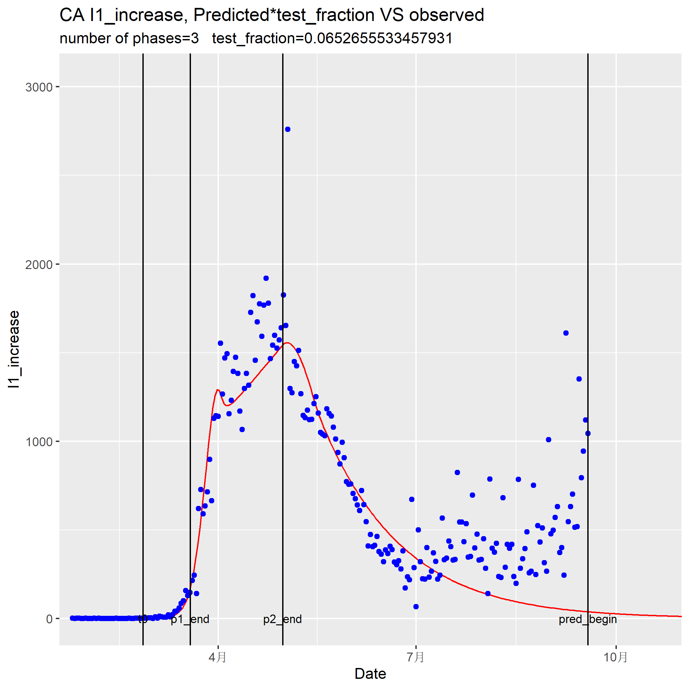
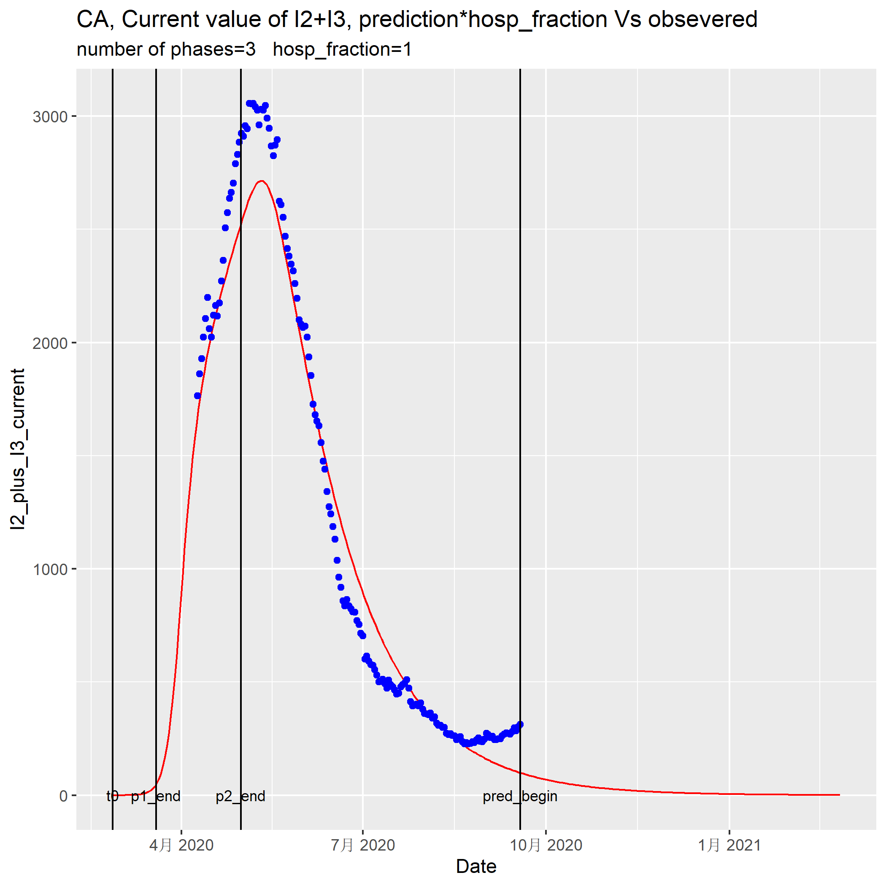
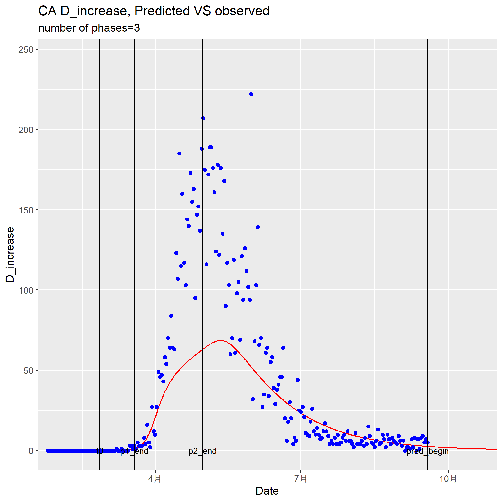

## Introduction
Rseir is a re-implement of the SEIRD parameter estimation and projection generation algorithm of the [pyseir](https://github.com/covid-projections/covid-data-model) program.

Pyseir is developed by [covidactnow.org](www.covidactnow.org)

Rseir is developed by me(QingXuan Kong), as part of the Educational Research project,[covidplan](https://covidplan.io/), led by [illinois Risk lab (iRisk lab)](https://irisklabuiuc.wixsite.com/actsi)

## the comparison of predicted and observed, Canada

## User guide
* Now it could run for both USA and Canada data, just go to the corresponding folder, open the rseir.Rmd and run according to the instruction.

* To run the program, first run "## the functions" chunk to load the functions, then run "## the main script".

* To change the parameters, you could change the corresponding <- assign in "## the main script".

* To change or add the state, change the state <- c("IL") assign in "## the main script"

* the SEIRD variables output is in outputs/SEIRD_data/.

* If you are looking for plots for a specific state, go to "outputs/plots_by_state". If you are looking for plots for a specific type, go to "outputs/plots".

## updata history

### 20201118
I1_and_hosp plot update.

Add a plot that shows put the I1 comparison plot and hospitalization comparison side by side, which illustrate an inconsistency between the observed data and the underlie model assumption.

### 20201011
Too busy for update documentation...

### 20201013
The two prgram for USA and Canada are merge into one. A country parameter is added in the setup parameter list.

New features:
1. Indicate the seqence number of state at the beginning of their run. 
2. Add some folder create code to make sure the output folders exist.

### 20200920
I update rseir, with a tweaked setup for the current Canada data in the "Canada" folder.
New features:

1. Now it could run for both USA and Canada data, just go to the corresponding folder, open the rpyseir_prototype.rmd and run according to the instruction.
2. I have added a "force correction" for negative increase, so you don't need to fix it in the observed dataset. Any negative increase value will be set as its previous value.
3. I add all of the plots I could think of. Please check outputs/plots_by_state.
4. A message will pop-up at the begin/end of the optimization for a state.

Test run on all Canada Provinces with 3 phases is done, and the output is in Canada/shared_version/outputs_20200920.zip. The plots are in Canada/outputs/shared_version/plots_by_state_20200920.zip (Including the SEIRD variable data and all of the plots I could think of).

I think the result of CA (Canada as a whole) is the best. 1/3 of provinces (5) in canada is excluded because their cumulative I1 is less than 60, which will should only yield a all 0 prediction.
